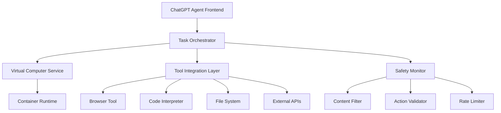

# ChatGPT Agent Overview - Model-Agnostic Analysis

## Executive Summary

ChatGPT Agent represents OpenAI's breakthrough into autonomous AI systems, released July 17, 2025. Unlike traditional chatbots, it functions as a full-fledged digital worker capable of planning, executing, and verifying complex multi-step tasks through its virtual computer environment.

## Key Capabilities

### Autonomous Task Execution
- Decomposes high-level requests into actionable subtasks
- Executes tasks without step-by-step human guidance
- Maintains context across long workflows (1M token memory)

### Multi-Modal Processing
- Text analysis and generation
- Visual content interpretation
- Code execution (Python, JavaScript)
- Document creation and manipulation

### Tool Integration
- Web browsing (text and visual modes)
- Calendar and scheduling systems
- External API connections
- Database interactions

## Architecture Highlights

The system employs a three-agent architecture:
1. **Planner Agent** - Strategic task decomposition
2. **Execution Agent** - Action implementation
3. **Verification Agent** - Quality assurance

## Safety Features

- Permission requests for irreversible actions
- Financial transaction restrictions
- Biological/chemical safety protocols
- Watch Mode for sensitive operations

## Use Cases

- Research and competitive analysis
- Travel planning and bookings
- Code development and debugging
- Document generation
- Data analysis and visualization

## Performance Metrics

- Context window: 1 million tokens
- Response latency: Optimized for complex tasks (15-30 minutes acceptable)
- Availability: Pro, Plus, Team tiers (Enterprise coming)

## Competitive Positioning

ChatGPT Agent surpasses competitors by combining:
- True autonomy vs. simple assistance
- Integrated virtual computer vs. API-only access
- Multi-agent orchestration vs. single model approach

---

# Additional Research Perspective: Comprehensive Technical Analysis

## Executive Summary

OpenAI's ChatGPT Agent, released on July 17, 2025, represents a fundamental paradigm shift from conversational AI to autonomous agentic systems capable of complex, multi-step task execution. Unlike traditional chatbots that provide one-shot responses, ChatGPT Agent operates using its own "virtual computer" environment, combining the capabilities of the previously separate Operator and Deep Research tools.

## Key Capabilities

### Virtual Computer Environment
- **Isolated Execution Context**: Each agent session runs in a containerized virtual environment
- **Persistent Session State**: Maintains context and files across multiple interactions
- **Tool Integration**: Seamless access to browser, code interpreter, file system, and external APIs
- **Security Sandboxing**: Multi-layered isolation preventing unauthorized access to host systems

### Autonomous Task Execution
- **Multi-Step Planning**: Breaks down complex requests into executable sub-tasks
- **Dynamic Tool Selection**: Intelligently chooses appropriate tools based on task requirements
- **Error Recovery**: Self-corrects and adapts when encountering failures or unexpected results
- **Progress Monitoring**: Real-time visibility into task execution status and intermediate results

### Enhanced Reasoning and Research
- **Deep Research Mode**: Comprehensive investigation capabilities with source verification
- **Cross-Reference Analysis**: Correlates information from multiple sources for accuracy
- **Citation Management**: Automatic source tracking and reference generation
- **Fact Verification**: Built-in mechanisms to validate information reliability

## Architecture Highlights

### Microservices Design

### Core Components
1. **Task Orchestrator**: Central coordination engine managing task decomposition and execution flow
2. **Virtual Computer Service**: Containerized environment providing isolated compute resources
3. **Tool Integration Layer**: Abstraction layer for seamless tool access and management
4. **Safety Monitor**: Real-time oversight ensuring compliance with usage policies and safety guidelines

## Technical Innovation

### Advanced Planning Engine
- **Hierarchical Task Decomposition**: Breaks complex goals into manageable sub-tasks
- **Dependency Analysis**: Identifies and manages task interdependencies
- **Resource Optimization**: Efficient allocation of compute and tool resources
- **Adaptive Execution**: Dynamic replanning based on intermediate results

### Safety and Control Mechanisms
- **Multi-Layer Validation**: Content filtering, action validation, and output verification
- **User Consent Gates**: Explicit approval required for sensitive operations
- **Audit Trail**: Comprehensive logging of all actions and decisions
- **Emergency Stop**: Immediate task termination capabilities

## Key Differentiators

### Compared to Traditional Chatbots
- **Persistent State**: Maintains context and workspace across sessions
- **Active Execution**: Performs actions rather than just providing information
- **Tool Orchestration**: Intelligently combines multiple tools to achieve goals
- **Error Handling**: Robust recovery mechanisms for failed operations

### Compared to Previous AI Agents
- **Virtual Environment**: Dedicated compute environment for each session
- **Safety Integration**: Built-in safety measures rather than bolt-on solutions
- **User Experience**: Streamlined interface hiding complex orchestration
- **Scalability**: Designed for enterprise-grade deployment and usage

## Impact and Applications

### Business Process Automation
- **Research and Analysis**: Comprehensive market research and competitive analysis
- **Content Creation**: Multi-format content generation with source verification
- **Data Processing**: Complex data analysis and report generation
- **Workflow Automation**: End-to-end business process execution

### Development and Engineering
- **Code Generation**: Full application development with testing and documentation
- **System Administration**: Infrastructure management and troubleshooting
- **Quality Assurance**: Automated testing and validation workflows
- **Documentation**: Technical documentation creation and maintenance

## Future Implications

The release of ChatGPT Agent marks a significant milestone in AI agent development, establishing new standards for:
- **Agent Architecture**: Modular, scalable design patterns for agentic systems
- **Safety Engineering**: Comprehensive approaches to AI agent safety and control
- **User Experience**: Intuitive interfaces for complex autonomous systems
- **Enterprise Integration**: Seamless integration with existing business workflows

This system represents the convergence of large language models, tool use capabilities, and robust engineering practices into a production-ready agentic AI platform.