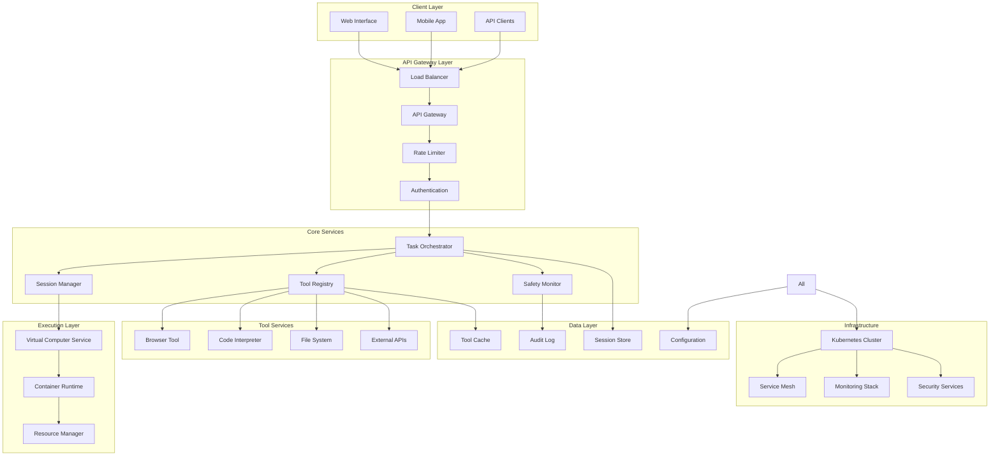
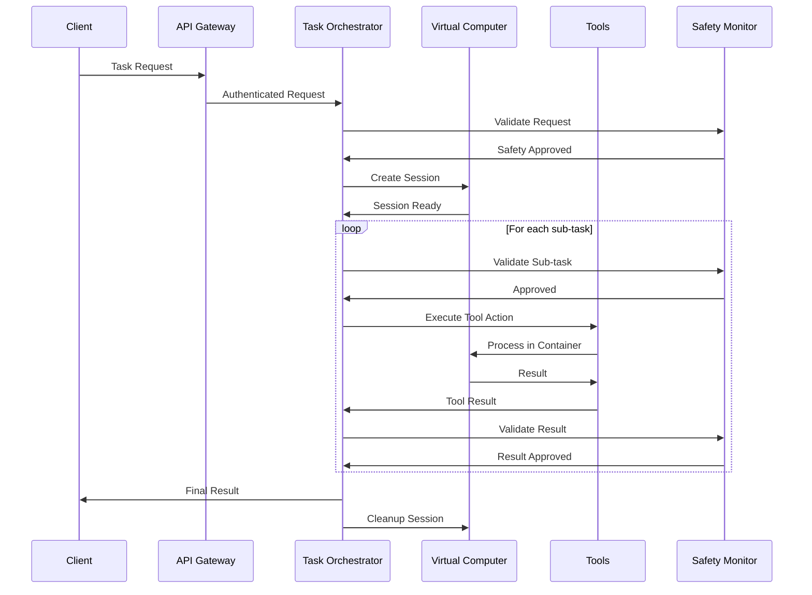

# ChatGPT Agent Architecture Deep Dive - Model-Agnostic Analysis

## System Architecture Overview

### Multi-Agent Orchestration Framework

```
┌─────────────────────────────────────────────────────────┐
│                   User Interface Layer                    │
├─────────────────────────────────────────────────────────┤
│                  Agent Orchestrator                       │
│  ┌─────────────┬──────────────┬────────────────────┐   │
│  │   Planner   │   Executor   │    Verifier        │   │
│  │    Agent    │    Agent     │     Agent          │   │
│  └─────────────┴──────────────┴────────────────────┘   │
├─────────────────────────────────────────────────────────┤
│                Virtual Computer Environment               │
│  ┌──────────┬───────────┬───────────┬──────────────┐   │
│  │ Browser  │   Code    │  Document │   Terminal   │   │
│  │  Tools   │ Executor  │  Creator  │   Access     │   │
│  └──────────┴───────────┴───────────┴──────────────┘   │
├─────────────────────────────────────────────────────────┤
│                    Safety Layer                           │
│  ┌─────────────┬──────────────┬────────────────────┐   │
│  │ Permission  │ Content      │ Biological/        │   │
│  │ Manager     │ Filter       │ Chemical Filter    │   │
│  └─────────────┴──────────────┴────────────────────┘   │
└─────────────────────────────────────────────────────────┘
```

## Core Components

### 1. Planner Agent

**Purpose**: Decomposes user requests into executable task forests

**Key Functions**:
- Hierarchical task decomposition
- Dependency graph construction
- Parallel execution path identification
- Resource requirement estimation

**Implementation Details**:
```python
class PlannerAgent:
    def create_plan(self, user_request):
        # Parse intent and requirements
        intent = self.parse_intent(user_request)
        
        # Generate task forest
        task_forest = self.decompose_to_tasks(intent)
        
        # Identify dependencies
        dependency_graph = self.build_dependencies(task_forest)
        
        # Optimize execution order
        execution_plan = self.optimize_execution(dependency_graph)
        
        return execution_plan
```

### 2. Execution Agent

**Purpose**: Carries out planned tasks using available tools

**Key Features**:
- Dynamic tool selection
- Parallel task execution
- Error handling and retry logic
- State management across tasks

**Tool Integration**:
- Web Browser (Chromium-based, headless)
- Code Interpreters (Python 3.11, Node.js 18)
- Document Generators (Markdown, DOCX, PDF)
- API Clients (REST, GraphQL)

### 3. Verification Agent

**Purpose**: Ensures output quality and safety compliance

**Verification Process**:
1. Output validation against expected schema
2. Safety check execution
3. Quality metrics evaluation
4. User requirement matching

## Virtual Computer Environment

### Architecture
- **Base**: Ubuntu Linux containers
- **Isolation**: Docker + gVisor for security
- **Resources**: Dynamic CPU/Memory allocation
- **Persistence**: Session-based state storage

### Security Model
```yaml
security_constraints:
  network:
    - allowed_protocols: [http, https]
    - blocked_ports: [22, 3389, 445]
  filesystem:
    - sandboxed_paths: [/workspace, /tmp]
    - read_only: [/usr, /bin, /lib]
  process:
    - max_processes: 100
    - memory_limit: 8GB
    - cpu_quota: 4_cores
```

## Communication Patterns

### Inter-Agent Messaging
- **Protocol**: gRPC with Protocol Buffers
- **Pattern**: Event-driven with message queuing
- **Failover**: Circuit breaker pattern implementation

### State Management
- **Storage**: Redis for ephemeral state
- **Persistence**: PostgreSQL for session data
- **Caching**: Multi-layer with TTL policies

## Scalability Architecture

### Horizontal Scaling
- Agent pools with dynamic sizing
- Load balancing via consistent hashing
- Auto-scaling based on queue depth

### Performance Optimization
- Task result caching
- Tool pre-warming
- Connection pooling for external services

## Model Infrastructure

### Base Model
- **Type**: GPT-4.1 variant with custom fine-tuning
- **Training**: Reinforcement Learning from Human Feedback (RLHF)
- **Context**: 1 million tokens
- **Inference**: Distributed across GPU clusters

### Specialized Models
- **Planner Model**: Optimized for task decomposition
- **Tool Use Model**: Fine-tuned on tool interaction patterns
- **Safety Model**: Specialized for risk detection

---

# Additional Research Perspective: Comprehensive Architecture Deep Dive

## System Architecture Overview

### High-Level Architecture Diagram



## Core Components Deep Dive

### 1. Task Orchestrator Service

The Task Orchestrator is the central nervous system of ChatGPT Agent, responsible for:

#### Architecture Pattern: Command + Strategy + Observer
```python
# Simplified Task Orchestrator architecture
class TaskOrchestrator:
    def __init__(self):
        self.planning_engine = PlanningEngine()
        self.execution_engine = ExecutionEngine()
        self.monitoring_service = MonitoringService()
        self.safety_monitor = SafetyMonitor()
        
    async def execute_task(self, task_request: TaskRequest) -> TaskResult:
        # Phase 1: Planning
        execution_plan = await self.planning_engine.create_plan(task_request)
        
        # Phase 2: Safety Validation
        validated_plan = await self.safety_monitor.validate_plan(execution_plan)
        
        # Phase 3: Execution
        result = await self.execution_engine.execute(validated_plan)
        
        # Phase 4: Monitoring and Feedback
        await self.monitoring_service.track_execution(result)
        
        return result
```

#### Key Responsibilities:
- **Task Decomposition**: Breaking complex requests into executable sub-tasks
- **Resource Allocation**: Managing compute and tool resources across sessions
- **Execution Coordination**: Orchestrating tool interactions and data flow
- **Error Recovery**: Handling failures and implementing retry logic
- **Progress Tracking**: Real-time status updates and intermediate result management

### 2. Virtual Computer Service

#### Containerization Strategy
```yaml
# Virtual Computer Container Specification
apiVersion: v1
kind: Pod
metadata:
  name: agent-session-{session_id}
  labels:
    app: chatgpt-agent
    session: {session_id}
spec:
  containers:
  - name: virtual-computer
    image: openai/agent-runtime:v1.0.0
    resources:
      requests:
        memory: "2Gi"
        cpu: "1"
      limits:
        memory: "8Gi"
        cpu: "4"
    securityContext:
      runAsNonRoot: true
      runAsUser: 1000
      allowPrivilegeEscalation: false
      readOnlyRootFilesystem: false
    volumeMounts:
    - name: session-storage
      mountPath: /workspace
    - name: tool-cache
      mountPath: /cache
  volumes:
  - name: session-storage
    emptyDir:
      sizeLimit: 10Gi
  - name: tool-cache
    configMap:
      name: tool-configurations
```

#### Security Architecture
```python
class VirtualComputerSecurity:
    def __init__(self):
        self.network_policy = NetworkPolicy()
        self.resource_limiter = ResourceLimiter()
        self.file_system_monitor = FileSystemMonitor()
        
    def apply_security_constraints(self, container_spec):
        # Network isolation
        self.network_policy.deny_all_egress()
        self.network_policy.allow_specific_endpoints([
            "api.openai.com",
            "tool-registry.internal"
        ])
        
        # Resource constraints
        self.resource_limiter.set_cpu_limit("4 cores")
        self.resource_limiter.set_memory_limit("8GB")
        self.resource_limiter.set_disk_limit("10GB")
        
        # File system monitoring
        self.file_system_monitor.block_sensitive_paths([
            "/etc/passwd",
            "/root",
            "/sys",
            "/proc"
        ])
```

### 3. Tool Integration Layer

#### Plugin Architecture Pattern
```python
from abc import ABC, abstractmethod
from typing import Dict, Any, Optional

class ToolInterface(ABC):
    """Abstract base class for all agent tools"""
    
    @abstractmethod
    async def execute(self, action: str, parameters: Dict[str, Any]) -> Dict[str, Any]:
        """Execute a tool action with given parameters"""
        pass
    
    @abstractmethod
    def get_capabilities(self) -> Dict[str, Any]:
        """Return tool capabilities and supported actions"""
        pass
    
    @abstractmethod
    def validate_parameters(self, action: str, parameters: Dict[str, Any]) -> bool:
        """Validate parameters for a given action"""
        pass

class BrowserTool(ToolInterface):
    def __init__(self):
        self.driver = ChromeDriver()
        self.security_policy = BrowserSecurityPolicy()
    
    async def execute(self, action: str, parameters: Dict[str, Any]) -> Dict[str, Any]:
        if action == "navigate":
            url = parameters["url"]
            if not self.security_policy.is_url_allowed(url):
                raise SecurityException(f"URL not allowed: {url}")
            
            await self.driver.navigate(url)
            return {"status": "success", "url": url}
        
        elif action == "extract_text":
            selector = parameters.get("selector", "body")
            text = await self.driver.extract_text(selector)
            return {"text": text}
        
        elif action == "screenshot":
            image_data = await self.driver.take_screenshot()
            return {"image": image_data}

class CodeInterpreter(ToolInterface):
    def __init__(self):
        self.python_runtime = PythonRuntime()
        self.code_validator = CodeValidator()
    
    async def execute(self, action: str, parameters: Dict[str, Any]) -> Dict[str, Any]:
        if action == "run_code":
            code = parameters["code"]
            language = parameters.get("language", "python")
            
            # Security validation
            if not self.code_validator.is_safe(code):
                raise SecurityException("Code contains unsafe operations")
            
            # Execute in sandboxed environment
            result = await self.python_runtime.execute(code)
            return {
                "output": result.stdout,
                "error": result.stderr,
                "return_code": result.return_code
            }
```

### 4. Safety Monitor Service

#### Multi-Layer Safety Architecture
```python
class SafetyMonitor:
    def __init__(self):
        self.content_filter = ContentFilter()
        self.action_validator = ActionValidator()
        self.rate_limiter = RateLimiter()
        self.audit_logger = AuditLogger()
    
    async def validate_plan(self, execution_plan: ExecutionPlan) -> ExecutionPlan:
        """Validate entire execution plan for safety"""
        
        # Layer 1: Content filtering
        for task in execution_plan.tasks:
            if not await self.content_filter.is_safe(task.description):
                raise SafetyException(f"Unsafe content detected: {task.description}")
        
        # Layer 2: Action validation
        for action in execution_plan.actions:
            if not await self.action_validator.is_allowed(action):
                raise SafetyException(f"Action not allowed: {action.type}")
        
        # Layer 3: Rate limiting
        if not await self.rate_limiter.check_limits(execution_plan):
            raise RateLimitException("Rate limit exceeded")
        
        # Layer 4: Audit logging
        await self.audit_logger.log_plan_validation(execution_plan)
        
        return execution_plan
    
    async def monitor_execution(self, execution_context: ExecutionContext):
        """Real-time monitoring during execution"""
        
        async for event in execution_context.events():
            # Real-time content filtering
            if event.type == "content_generation":
                if not await self.content_filter.is_safe(event.content):
                    await execution_context.halt_execution()
                    raise SafetyException("Unsafe content generated during execution")
            
            # Action monitoring
            elif event.type == "tool_action":
                if not await self.action_validator.is_allowed(event.action):
                    await execution_context.halt_execution()
                    raise SafetyException("Unauthorized action attempted")
            
            # Log all events
            await self.audit_logger.log_execution_event(event)
```

## Data Flow Architecture

### Request Processing Flow


### Inter-Service Communication

#### Service Mesh Configuration
```yaml
# Istio Service Mesh Configuration
apiVersion: networking.istio.io/v1alpha3
kind: VirtualService
metadata:
  name: chatgpt-agent-routing
spec:
  http:
  - match:
    - uri:
        prefix: "/api/v1/tasks"
    route:
    - destination:
        host: task-orchestrator
        port:
          number: 8080
      weight: 100
    fault:
      delay:
        percentage:
          value: 0.1
        fixedDelay: 5s
    retries:
      attempts: 3
      perTryTimeout: 10s
```

#### Message Queue Architecture
```python
# Event-driven communication between services
class ServiceCommunication:
    def __init__(self):
        self.message_broker = RabbitMQ()
        self.event_bus = EventBus()
    
    async def publish_task_event(self, event: TaskEvent):
        """Publish task-related events to interested services"""
        await self.message_broker.publish(
            exchange="agent.tasks",
            routing_key=f"task.{event.type}",
            message=event.to_json(),
            properties={
                "delivery_mode": 2,  # Persistent
                "correlation_id": event.task_id,
                "timestamp": event.timestamp
            }
        )
    
    async def handle_tool_result(self, result: ToolResult):
        """Handle asynchronous tool execution results"""
        await self.event_bus.emit(
            event_type="tool.result",
            data={
                "tool_id": result.tool_id,
                "session_id": result.session_id,
                "result": result.data,
                "execution_time": result.execution_time
            }
        )
```

## Scalability and Performance

### Horizontal Scaling Strategy
```yaml
# Kubernetes Horizontal Pod Autoscaler
apiVersion: autoscaling/v2
kind: HorizontalPodAutoscaler
metadata:
  name: task-orchestrator-hpa
spec:
  scaleTargetRef:
    apiVersion: apps/v1
    kind: Deployment
    name: task-orchestrator
  minReplicas: 3
  maxReplicas: 100
  metrics:
  - type: Resource
    resource:
      name: cpu
      target:
        type: Utilization
        averageUtilization: 70
  - type: Resource
    resource:
      name: memory
      target:
        type: Utilization
        averageUtilization: 80
  - type: Pods
    pods:
      metric:
        name: concurrent_sessions
      target:
        type: AverageValue
        averageValue: "50"
```

### Caching Strategy
```python
class CachingStrategy:
    def __init__(self):
        self.redis_cluster = RedisCluster()
        self.cdn = CloudFlare()
    
    async def cache_tool_result(self, tool_action: str, parameters: Dict, result: Any):
        """Cache tool results for faster future execution"""
        cache_key = self._generate_cache_key(tool_action, parameters)
        
        await self.redis_cluster.setex(
            key=cache_key,
            value=json.dumps(result),
            ex=3600  # 1 hour TTL
        )
    
    async def get_cached_result(self, tool_action: str, parameters: Dict) -> Optional[Any]:
        """Retrieve cached tool result if available"""
        cache_key = self._generate_cache_key(tool_action, parameters)
        
        cached_result = await self.redis_cluster.get(cache_key)
        if cached_result:
            return json.loads(cached_result)
        
        return None
```

This deep dive covers the core architectural components, data flows, and technical implementation details of the ChatGPT Agent system, providing insight into how OpenAI built a scalable, secure, and robust agentic AI platform.