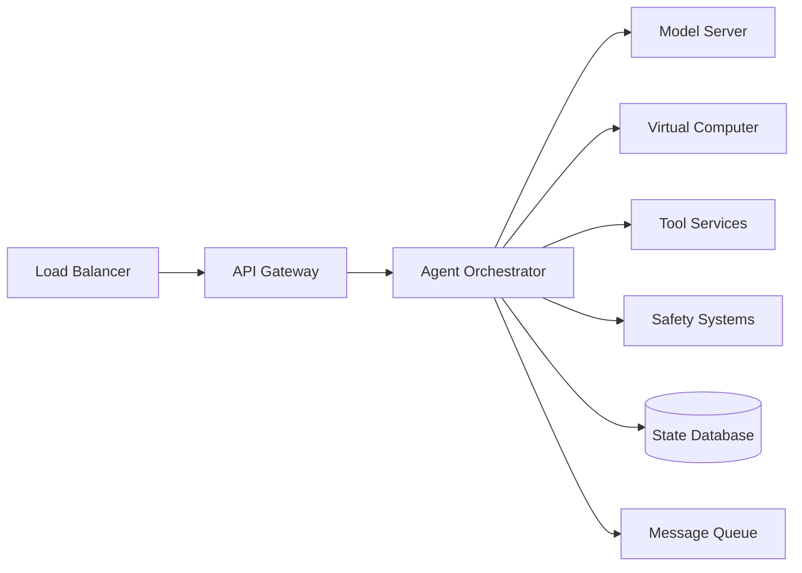

# ChatGPT Agent: Operational Runbook

## Table of Contents
1. [System Overview](#system-overview)
2. [Monitoring & Alerting](#monitoring--alerting)
3. [Incident Response](#incident-response)
4. [Deployment Procedures](#deployment-procedures)
5. [Scaling Operations](#scaling-operations)
6. [Security Procedures](#security-procedures)
7. [Disaster Recovery](#disaster-recovery)

## System Overview

### Critical Components
- **Agent Orchestrator**: Core service managing agent coordination
- **Virtual Computer Clusters**: Sandboxed execution environments
- **Model Serving Infrastructure**: GPU clusters for inference
- **Tool Services**: Browser, code executor, API gateways
- **Safety Systems**: Content filters, permission managers

### Service Dependencies


## Monitoring & Alerting

### Key Metrics

#### System Health Metrics
```yaml
metrics:
  - name: agent_request_rate
    threshold: 10000/min
    alert: P2
    
  - name: agent_success_rate
    threshold: < 95%
    alert: P1
    
  - name: average_task_latency
    threshold: > 30s
    alert: P2
    
  - name: virtual_computer_utilization
    threshold: > 80%
    alert: P2
    
  - name: model_inference_latency_p99
    threshold: > 2s
    alert: P1
```

#### Business Metrics Dashboard
```python
# Prometheus query examples
rate(agent_requests_total[5m])  # Request rate
histogram_quantile(0.99, agent_task_duration_seconds)  # P99 latency
sum(agent_active_sessions) by (tier)  # Active sessions by user tier
rate(safety_violations_total[1h])  # Safety incident rate
```

### Alerting Rules

#### P1 Alerts (Immediate Response)
```yaml
groups:
  - name: critical_alerts
    rules:
      - alert: HighErrorRate
        expr: rate(agent_errors_total[5m]) > 0.05
        for: 2m
        labels:
          severity: P1
        annotations:
          summary: "High error rate detected"
          
      - alert: ModelServerDown
        expr: up{job="model-server"} == 0
        for: 1m
        labels:
          severity: P1
```

#### P2 Alerts (Response within 1 hour)
```yaml
      - alert: HighMemoryUsage
        expr: container_memory_usage_bytes / container_spec_memory_limit_bytes > 0.9
        for: 5m
        labels:
          severity: P2
```

## Incident Response

### Incident Classification

| Severity | Description | Response Time | Examples |
|----------|-------------|---------------|----------|
| P1 | Service Down/Degraded | 5 minutes | Model server crash, >5% error rate |
| P2 | Performance Issues | 1 hour | High latency, resource constraints |
| P3 | Minor Issues | 4 hours | Individual task failures |
| P4 | Non-critical | Next business day | UI bugs, documentation |

### Response Procedures

#### P1: Service Outage Response
```bash
#!/bin/bash
# emergency_response.sh

# 1. Acknowledge alert
pagerduty-cli acknowledge $INCIDENT_ID

# 2. Check service health
kubectl get pods -n chatgpt-agent -l app=orchestrator
kubectl get pods -n chatgpt-agent -l app=model-server

# 3. Check recent deployments
kubectl rollout history deployment/agent-orchestrator -n chatgpt-agent

# 4. If recent deployment, rollback
kubectl rollout undo deployment/agent-orchestrator -n chatgpt-agent

# 5. Scale up healthy components
kubectl scale deployment/agent-orchestrator --replicas=10 -n chatgpt-agent

# 6. Enable circuit breakers
kubectl exec -it orchestrator-pod -- ./enable_safety_mode.sh
```

#### P2: Performance Degradation
```python
# performance_investigation.py
import subprocess
import json

def diagnose_performance():
    # Check CPU/Memory usage
    metrics = get_resource_metrics()
    
    # Check database connections
    db_status = check_database_pool()
    
    # Check external service latencies
    service_health = check_external_services()
    
    # Generate report
    report = {
        "timestamp": datetime.now().isoformat(),
        "resource_usage": metrics,
        "database_status": db_status,
        "external_services": service_health
    }
    
    # Auto-remediation suggestions
    if metrics["cpu_usage"] > 80:
        report["recommendation"] = "Scale out compute nodes"
    elif db_status["connection_pool_exhausted"]:
        report["recommendation"] = "Increase connection pool size"
        
    return report
```

### Incident Communication

#### Stakeholder Matrix
| Incident Type | Engineering | Product | Leadership | Users |
|--------------|-------------|---------|------------|-------|
| P1 Outage | Immediate | 5 min | 15 min | Status page |
| P2 Degradation | 15 min | 30 min | 1 hour | If visible |
| P3 Issues | 1 hour | Daily sync | Weekly | No |

#### Status Page Updates
```markdown
# Template: Service Degradation

**Issue**: Elevated latency in ChatGPT Agent responses
**Status**: Investigating
**Impact**: ~15% of requests experiencing 2x normal latency
**Started**: 2025-07-20 14:30 UTC

## Updates
- 14:45 UTC - Identified resource constraint in virtual computer pool
- 15:00 UTC - Scaling additional compute resources
- 15:15 UTC - Performance returning to normal
```

## Deployment Procedures

### Pre-deployment Checklist
```yaml
pre_deployment:
  - verify: All tests passing in CI
  - verify: Security scan completed
  - verify: Performance benchmarks within tolerance
  - verify: Rollback plan documented
  - verify: Change approval obtained
  - action: Notify on-call engineer
  - action: Update deployment calendar
```

### Canary Deployment Process

```bash
#!/bin/bash
# canary_deploy.sh

VERSION=$1
CANARY_PERCENTAGE=5

echo "Starting canary deployment of version $VERSION"

# 1. Deploy to canary nodes
kubectl set image deployment/agent-orchestrator \
  orchestrator=openai/chatgpt-agent:$VERSION \
  -n chatgpt-agent-canary

# 2. Wait for rollout
kubectl rollout status deployment/agent-orchestrator -n chatgpt-agent-canary

# 3. Route small percentage of traffic
kubectl patch virtualservice agent-routing -n istio-system \
  --type merge \
  -p '{"spec":{"http":[{"match":[{"headers":{"canary":{"exact":"true"}}}],"route":[{"destination":{"host":"agent-orchestrator-canary"}}],"weight":'$CANARY_PERCENTAGE'}]}}'

# 4. Monitor metrics for 30 minutes
./monitor_canary.sh 30m

# 5. Check success criteria
if check_canary_health; then
    echo "Canary healthy, proceeding with rollout"
    ./progressive_rollout.sh $VERSION
else
    echo "Canary failed health checks, rolling back"
    ./rollback_canary.sh
fi
```

### Progressive Rollout
```python
# progressive_rollout.py
import time
import metrics_client

def progressive_rollout(version, stages=[5, 25, 50, 100]):
    for percentage in stages:
        print(f"Rolling out to {percentage}% of traffic")
        
        # Update traffic split
        update_traffic_split(version, percentage)
        
        # Monitor for issues
        start_time = time.time()
        monitoring_duration = 300 if percentage < 100 else 600
        
        while time.time() - start_time < monitoring_duration:
            metrics = get_current_metrics()
            
            if not health_check(metrics):
                print(f"Health check failed at {percentage}%")
                rollback(previous_version)
                return False
                
            time.sleep(30)
    
    print("Rollout completed successfully")
    return True
```

## Scaling Operations

### Auto-scaling Configuration
```yaml
apiVersion: autoscaling/v2
kind: HorizontalPodAutoscaler
metadata:
  name: agent-orchestrator-hpa
spec:
  scaleTargetRef:
    apiVersion: apps/v1
    kind: Deployment
    name: agent-orchestrator
  minReplicas: 10
  maxReplicas: 100
  metrics:
  - type: Resource
    resource:
      name: cpu
      target:
        type: Utilization
        averageUtilization: 70
  - type: Pods
    pods:
      metric:
        name: agent_request_rate
      target:
        type: AverageValue
        averageValue: "1000"
```

### Manual Scaling Procedures
```bash
# Scale for high load event
kubectl scale deployment/agent-orchestrator --replicas=50
kubectl scale deployment/virtual-computer --replicas=100
kubectl scale deployment/model-server --replicas=20

# Scale down after event
kubectl scale deployment/agent-orchestrator --replicas=10
kubectl scale deployment/virtual-computer --replicas=30
kubectl scale deployment/model-server --replicas=5
```

## Security Procedures

### Security Incident Response
```python
class SecurityIncidentHandler:
    def handle_security_event(self, event):
        severity = self.classify_severity(event)
        
        if severity == "CRITICAL":
            # Immediate isolation
            self.isolate_affected_resources(event.resources)
            self.notify_security_team()
            self.create_incident_ticket()
            
        # Log for audit
        self.security_logger.log(event)
        
        # Update safety filters
        if event.type == "PROMPT_INJECTION":
            self.update_prompt_filters(event.pattern)
```

### Regular Security Audits
```yaml
security_audit_schedule:
  daily:
    - vulnerability_scanning
    - access_log_review
    - anomaly_detection
  weekly:
    - permission_audit
    - certificate_expiry_check
    - security_patch_review
  monthly:
    - penetration_testing
    - compliance_review
    - third_party_audit
```

## Disaster Recovery

### Backup Procedures
```bash
#!/bin/bash
# backup_critical_data.sh

# Backup model checkpoints
aws s3 sync /models/ s3://chatgpt-agent-backups/models/$(date +%Y%m%d)/

# Backup configuration
kubectl get configmap -n chatgpt-agent -o yaml > configs_backup_$(date +%Y%m%d).yaml

# Backup persistent volumes
for pv in $(kubectl get pv -o name); do
    kubectl get $pv -o yaml > pv_backup_$(basename $pv)_$(date +%Y%m%d).yaml
done

# Backup database
pg_dump -h $DB_HOST -U $DB_USER -d agent_state > db_backup_$(date +%Y%m%d).sql
```

### Recovery Procedures
```python
# disaster_recovery.py
class DisasterRecovery:
    def execute_recovery_plan(self, disaster_type):
        if disaster_type == "REGION_FAILURE":
            # Failover to secondary region
            self.dns_manager.update_records(secondary_region)
            self.traffic_manager.route_to_region(secondary_region)
            
        elif disaster_type == "DATA_CORRUPTION":
            # Restore from backup
            latest_backup = self.find_latest_clean_backup()
            self.restore_from_backup(latest_backup)
            
        elif disaster_type == "SECURITY_BREACH":
            # Rotate all credentials
            self.credential_manager.rotate_all()
            self.audit_access_logs()
            self.apply_security_patches()
```

### RTO/RPO Targets
| Service Component | RTO (Recovery Time) | RPO (Data Loss) |
|------------------|---------------------|-----------------|
| API Gateway | 5 minutes | 0 minutes |
| Agent Orchestrator | 10 minutes | 5 minutes |
| Model Server | 30 minutes | 1 hour |
| Virtual Computers | 15 minutes | 0 minutes |
| State Database | 1 hour | 5 minutes |

## Appendices

### A. Emergency Contacts
```yaml
contacts:
  on_call_engineer: pagerduty://chatgpt-agent-oncall
  incident_commander: pagerduty://incident-commander
  security_team: security@openai.com
  leadership: leadership-escalation@openai.com
```

### B. Useful Commands
```bash
# Quick health check
kubectl get pods -n chatgpt-agent | grep -v Running

# View recent errors
kubectl logs -n chatgpt-agent -l app=orchestrator --since=1h | grep ERROR

# Check resource usage
kubectl top pods -n chatgpt-agent

# Force restart unhealthy pods
kubectl delete pods -n chatgpt-agent --field-selector status.phase=Failed
```

### C. Monitoring URLs
- Grafana Dashboard: https://grafana.openai.internal/d/chatgpt-agent
- Prometheus: https://prometheus.openai.internal
- Status Page: https://status.openai.com
- Incident Management: https://openai.pagerduty.com

---

*Last Updated: July 2025*  
*Version: 1.0*  
*Next Review: October 2025*