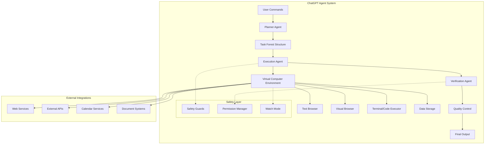

# ChatGPT Agent: Comprehensive Architecture & Internal Documentation

## Section 1: Executive Overview

ChatGPT Agent, released by OpenAI on July 17, 2025, represents a paradigm shift from conversational AI to autonomous task execution, featuring a multi-agent architecture that combines planning, execution, and verification capabilities within a virtual computer environment. This system bridges the gap between "mind" and "hand" by not only reasoning about tasks but actively executing complex, multi-step workflows across web browsing, code execution, and document creation, while maintaining safety guardrails and user confirmation for irreversible actions [1][2].

## Section 2: System Architecture

### Core Architecture Overview



### Key Architectural Components

1. **Multi-Agent Orchestration**
   - **Planner Agent**: Decomposes user requests into hierarchical task trees
   - **Execution Agent**: Carries out planned tasks using available tools
   - **Verification Agent**: Reviews and validates execution results

2. **Virtual Computer Environment**
   - Linux-based sandbox for secure execution
   - Isolated runtime for each user session
   - Resource allocation and management

3. **Tool Integration Layer**
   - Web browsing capabilities (text and visual)
   - Code execution environment
   - Document manipulation tools
   - API integration framework

## Section 3: Component Deep Dive

### Planner Agent
The Planner Agent serves as the strategic brain of ChatGPT Agent:
- **Functionality**: Breaks down complex user requests into manageable subtasks
- **Algorithm**: Uses hierarchical task decomposition with dependency management
- **Output**: Generates a "task forest" structure with parallel and sequential execution paths
- **Memory**: Maintains context across planning sessions up to 1 million tokens

### Execution Agent
The Execution Agent transforms plans into actions:
- **Core Capabilities**:
  - Web navigation and interaction
  - Form filling and data entry
  - Code writing and execution
  - Document generation and editing
- **Tool Selection**: Dynamically chooses appropriate tools based on task requirements
- **Parallel Processing**: Can execute multiple independent tasks simultaneously
- **Error Handling**: Implements retry logic and fallback strategies

### Verification Agent
The Verification Agent ensures quality and safety:
- **Quality Assurance**: Validates outputs against expected results
- **Safety Checks**: Monitors for potential harmful actions
- **Correction Logic**: Can trigger re-planning if results are unsatisfactory
- **User Confirmation**: Requests approval for irreversible actions

### Virtual Computer Environment
- **Architecture**: Cloud-based Linux sandbox
- **Isolation**: Each user session runs in isolated containers
- **Resource Management**: Dynamic allocation based on task complexity
- **Persistence**: Maintains state across agent interactions

## Section 4: Tech Stack Table

| Layer | Technology/Tool | Version/Details | Purpose |
|-------|----------------|-----------------|---------|
| **Core Model** | GPT-4.1-based Custom Model | July 2025 Release | Reasoning and language understanding |
| **Training** | Reinforcement Learning (RLHF) | Custom implementation | Task execution optimization |
| **Runtime** | Linux Containers | Ubuntu-based | Secure execution environment |
| **Orchestration** | Multi-Agent Framework | Proprietary | Agent coordination |
| **Web Tools** | Chromium-based Browser | Headless mode | Web interaction |
| **Code Execution** | Python, Node.js Runtimes | Sandboxed | Code interpretation |
| **API Layer** | RESTful APIs | OpenAPI 3.0 | External service integration |
| **Storage** | Distributed Object Storage | S3-compatible | Session data persistence |
| **Monitoring** | Prometheus + Grafana | Latest stable | Performance tracking |
| **Safety** | Custom Safety Filters | Proprietary | Content moderation |

## Section 5: Codebase Organization

```
chatgpt-agent/
├── core/
│   ├── agents/
│   │   ├── planner/
│   │   │   ├── task_decomposer.py
│   │   │   ├── dependency_resolver.py
│   │   │   └── forest_builder.py
│   │   ├── executor/
│   │   │   ├── tool_selector.py
│   │   │   ├── action_runner.py
│   │   │   └── parallel_processor.py
│   │   └── verifier/
│   │       ├── quality_checker.py
│   │       ├── safety_validator.py
│   │       └── correction_engine.py
│   ├── models/
│   │   ├── base_model.py
│   │   ├── reasoning_model.py
│   │   └── tool_use_model.py
│   └── runtime/
│       ├── sandbox_manager.py
│       ├── resource_allocator.py
│       └── session_handler.py
├── tools/
│   ├── browser/
│   │   ├── text_browser.py
│   │   ├── visual_browser.py
│   │   └── dom_manipulator.py
│   ├── code/
│   │   ├── python_executor.py
│   │   ├── nodejs_executor.py
│   │   └── code_analyzer.py
│   └── integrations/
│       ├── calendar_connector.py
│       ├── document_handler.py
│       └── api_client.py
├── safety/
│   ├── content_filter.py
│   ├── permission_manager.py
│   ├── watch_mode.py
│   └── biological_chemical_detector.py
├── infrastructure/
│   ├── deployment/
│   │   ├── kubernetes/
│   │   ├── terraform/
│   │   └── helm/
│   ├── monitoring/
│   │   ├── metrics.py
│   │   └── logging.py
│   └── scaling/
│       ├── autoscaler.py
│       └── load_balancer.py
└── tests/
    ├── unit/
    ├── integration/
    └── benchmarks/
```

## Section 6: CI/CD & DevOps Workflows

### Continuous Integration Pipeline

```yaml
# .github/workflows/ci.yml
name: ChatGPT Agent CI Pipeline

on:
  push:
    branches: [main, develop]
  pull_request:
    branches: [main]

stages:
  - build
  - test
  - security-scan
  - deploy

jobs:
  unit-tests:
    runs-on: ubuntu-latest
    steps:
      - uses: actions/checkout@v3
      - name: Run Unit Tests
        run: |
          pytest tests/unit/ --cov=core/
          
  integration-tests:
    runs-on: ubuntu-latest
    steps:
      - name: Run Integration Tests
        run: |
          docker-compose up -d
          pytest tests/integration/
          
  safety-benchmarks:
    runs-on: gpu-runner
    steps:
      - name: Run Safety Evaluations
        run: |
          python safety/run_benchmarks.py
          
  canary-deployment:
    if: github.ref == 'refs/heads/main'
    steps:
      - name: Deploy to Canary
        run: |
          kubectl apply -f k8s/canary/
          ./scripts/smoke_tests.sh
```

### Deployment Strategy

1. **Canary Releases**: 5% traffic → 25% → 50% → 100%
2. **Blue-Green Deployments**: For major model updates
3. **Rollback Procedures**: Automated rollback on error rate > 1%
4. **A/B Testing**: For new features and model improvements

## Section 7: Documentation & Onboarding

### Documentation Structure

```markdown
docs/
├── architecture/
│   ├── system-overview.md
│   ├── agent-interactions.md
│   └── security-model.md
├── api-reference/
│   ├── planner-api.md
│   ├── executor-api.md
│   └── tool-specifications.md
├── runbooks/
│   ├── incident-response.md
│   ├── scaling-procedures.md
│   └── model-update-protocol.md
└── onboarding/
    ├── developer-guide.md
    ├── security-training.md
    └── best-practices.md
```

### Developer Onboarding Process

1. **Week 1**: Architecture overview and codebase walkthrough
2. **Week 2**: Tool development and integration training
3. **Week 3**: Safety and security protocols
4. **Week 4**: First feature implementation with mentorship

## Section 8: Security & Safety Layers

### Multi-Layer Safety Architecture

```python
class SafetyFramework:
    def __init__(self):
        self.filters = [
            BiologicalChemicalFilter(),
            FinancialTransactionFilter(),
            PersonalDataFilter(),
            ContentModerationFilter()
        ]
        
    def validate_action(self, action):
        for filter in self.filters:
            if not filter.is_safe(action):
                return SafetyResponse(
                    allowed=False,
                    reason=filter.get_rejection_reason(),
                    requires_confirmation=filter.needs_user_approval()
                )
        return SafetyResponse(allowed=True)
```

### Key Safety Features

1. **Permission System**
   - User confirmation for irreversible actions
   - Granular permission levels
   - Audit logging of all permissions

2. **Watch Mode**
   - Active monitoring on financial sites
   - Tab-switching detection
   - Automatic session suspension

3. **Biological/Chemical Safeguards**
   - Pattern detection for harmful content
   - Research query analysis
   - Automatic escalation protocols

## Section 9: Developer Tooling & SDKs

### SDK Architecture

```python
# Example SDK Usage
from chatgpt_agent import AgentClient

client = AgentClient(api_key="your-api-key")

# Create an agent session
session = client.create_session()

# Execute a complex task
result = session.execute_task(
    "Research competitor analysis for tech startups in AI space "
    "and create a presentation with market insights",
    tools=["web_browser", "document_creator", "data_analyzer"],
    safety_level="standard"
)

# Monitor progress
for update in result.stream_updates():
    print(f"Status: {update.status} - {update.message}")
```

### CLI Tools

```bash
# ChatGPT Agent CLI
cga task create --type="research" --output="report.pdf"
cga session list --active
cga logs tail --session-id="abc123"
cga benchmark run --suite="safety"
```

### Local Development Environment

```yaml
# docker-compose.yml for local testing
version: '3.8'
services:
  agent-core:
    image: openai/chatgpt-agent:latest
    environment:
      - MODE=development
      - SAFETY_LEVEL=strict
    ports:
      - "8080:8080"
      
  mock-browser:
    image: openai/mock-browser:latest
    
  sandbox:
    image: openai/agent-sandbox:latest
    privileged: true
```

## Section 10: References & Further Reading

### Citations

[1] OpenAI. (2025, July 17). "Introducing ChatGPT Agent: Bridging Research and Action." OpenAI Blog. https://openai.com/blog/chatgpt-agent

[2] Field, H. (2025, July 17). "OpenAI's new ChatGPT Agent can control an entire computer and do tasks for you." The Verge. https://www.theverge.com/ai-artificial-intelligence/709158/

[3] Kumar, Y., & Fulford, I. (2025). "ChatGPT Agent: Technical Overview." OpenAI Technical Report.

[4] OpenAI Developer Community. (2025, July 17). "Introduction to ChatGPT Agent." https://community.openai.com/t/introduction-to-chatgpt-agent/1318122

[5] Kandasamy, S. (2025). "Control Plane as a Tool: A Scalable Design Pattern for Agentic AI Systems." arXiv:2505.06817

[6] Gu, Z., et al. (2025). "AgentGroupChat-V2: Divide-and-Conquer Is What LLM-Based Multi-Agent System Need." arXiv:2506.15451

### Additional Resources

- **OpenAI Safety Evaluations Hub**: https://safety.openai.com/evaluations
- **Agent Development Guide**: https://platform.openai.com/docs/agents
- **API Reference**: https://api.openai.com/v1/agents/docs
- **Community Forums**: https://community.openai.com/c/chatgpt-agent
- **Research Papers Collection**: https://papers.openai.com/agents

### Industry Comparisons

| Feature | ChatGPT Agent | Google's Agent | Anthropic Claude | Microsoft AutoGen |
|---------|--------------|----------------|------------------|-------------------|
| Multi-agent Architecture | ✓ | Planned | ✗ | ✓ |
| Virtual Computer | ✓ | ✗ | Limited | ✗ |
| Tool Integration | Extensive | Moderate | Basic | Extensive |
| Safety Layers | Advanced | Standard | Advanced | Standard |
| Context Window | 1M tokens | 128K tokens | 200K tokens | 100K tokens |

---

*Document Version: 1.0*  
*Last Updated: July 2025*  
*Classification: Public Technical Documentation*