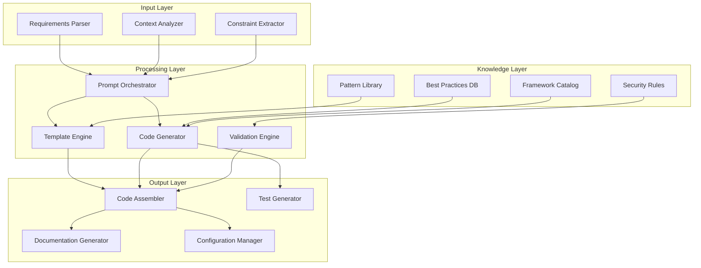

# Codebase Generation Prompt Architecture Deep Dive

## System Architecture Overview

### Core Components Architecture



## Prompt Engineering Architecture

### Hierarchical Prompt System

#### Master Prompt Template
```python
class MasterPromptTemplate:
    """
    Top-level prompt template for codebase generation
    """
    
    def __init__(self):
        self.system_context = SystemContextBuilder()
        self.project_requirements = ProjectRequirementsAnalyzer()
        self.architectural_patterns = ArchitecturalPatternSelector()
        self.quality_constraints = QualityConstraintManager()
    
    def generate_master_prompt(self, project_spec: ProjectSpecification) -> str:
        return f"""
        # Codebase Generation Master Prompt
        
        ## Project Overview
        {self._generate_project_overview(project_spec)}
        
        ## Architectural Requirements
        {self._generate_architectural_requirements(project_spec)}
        
        ## Technical Constraints
        {self._generate_technical_constraints(project_spec)}
        
        ## Quality Standards
        {self._generate_quality_standards(project_spec)}
        
        ## Generation Guidelines
        {self._generate_generation_guidelines(project_spec)}
        
        ## Validation Criteria
        {self._generate_validation_criteria(project_spec)}
        """
    
    def _generate_project_overview(self, spec: ProjectSpecification) -> str:
        """Generate comprehensive project context"""
        return f"""
        ### Project Scope
        - **Domain**: {spec.domain}
        - **Scale**: {spec.scale} ({spec.estimated_components} components)
        - **Timeline**: {spec.timeline}
        - **Team Size**: {spec.team_size} developers
        
        ### Primary Objectives
        {self._format_objectives(spec.objectives)}
        
        ### Success Criteria
        {self._format_success_criteria(spec.success_criteria)}
        
        ### Stakeholder Requirements
        {self._format_stakeholder_requirements(spec.stakeholders)}
        """
    
    def _generate_architectural_requirements(self, spec: ProjectSpecification) -> str:
        """Define architectural constraints and patterns"""
        selected_patterns = self.architectural_patterns.select_patterns(spec)
        
        return f"""
        ### Architecture Style
        - **Primary Pattern**: {selected_patterns.primary}
        - **Supporting Patterns**: {', '.join(selected_patterns.supporting)}
        - **Integration Style**: {selected_patterns.integration_style}
        
        ### System Boundaries
        {self._define_system_boundaries(spec)}
        
        ### Component Relationships
        {self._define_component_relationships(selected_patterns)}
        
        ### Data Flow Architecture
        {self._define_data_flow(spec, selected_patterns)}
        """
```

#### Component-Level Prompt Generation
```python
class ComponentPromptGenerator:
    """
    Generates detailed prompts for individual system components
    """
    
    def __init__(self):
        self.template_library = ComponentTemplateLibrary()
        self.dependency_analyzer = DependencyAnalyzer()
        self.interface_designer = InterfaceDesigner()
    
    def generate_component_prompt(self, component_spec: ComponentSpecification, 
                                context: SystemContext) -> ComponentPrompt:
        """
        Generate detailed prompt for individual component implementation
        """
        
        dependencies = self.dependency_analyzer.analyze_dependencies(
            component_spec, context
        )
        
        interfaces = self.interface_designer.design_interfaces(
            component_spec, dependencies
        )
        
        template = self.template_library.get_template(
            component_spec.type, component_spec.technology_stack
        )
        
        return ComponentPrompt(
            component_id=component_spec.id,
            prompt_text=self._build_component_prompt(
                component_spec, dependencies, interfaces, template
            ),
            validation_rules=self._generate_validation_rules(component_spec),
            test_requirements=self._generate_test_requirements(component_spec)
        )
    
    def _build_component_prompt(self, spec: ComponentSpecification,
                               dependencies: List[Dependency],
                               interfaces: List[Interface],
                               template: ComponentTemplate) -> str:
        return f"""
        # Component Implementation: {spec.name}
        
        ## Component Specification
        - **Type**: {spec.type}
        - **Responsibility**: {spec.responsibility}
        - **Technology Stack**: {', '.join(spec.technology_stack)}
        - **Performance Requirements**: {spec.performance_requirements}
        
        ## Dependencies
        {self._format_dependencies(dependencies)}
        
        ## Interface Definitions
        {self._format_interfaces(interfaces)}
        
        ## Implementation Guidelines
        {template.implementation_guidelines}
        
        ## Code Structure
        {template.code_structure}
        
        ## Error Handling
        {template.error_handling_patterns}
        
        ## Testing Requirements
        {self._format_testing_requirements(spec)}
        
        ## Documentation Requirements
        {template.documentation_standards}
        """
```

### Adaptive Prompt Optimization

#### Context-Aware Prompt Adaptation
```python
class AdaptivePromptOptimizer:
    """
    Optimizes prompts based on generation context and feedback
    """
    
    def __init__(self):
        self.performance_tracker = PromptPerformanceTracker()
        self.context_analyzer = GenerationContextAnalyzer()
        self.optimization_engine = PromptOptimizationEngine()
    
    async def optimize_prompt(self, base_prompt: str, 
                            generation_context: GenerationContext) -> OptimizedPrompt:
        """
        Adapt prompt based on current generation context and historical performance
        """
        
        # Analyze current context
        context_analysis = await self.context_analyzer.analyze(generation_context)
        
        # Retrieve performance metrics for similar contexts
        performance_data = await self.performance_tracker.get_performance_data(
            context_analysis.context_signature
        )
        
        # Apply optimization strategies
        optimization_strategies = await self._select_optimization_strategies(
            context_analysis, performance_data
        )
        
        optimized_prompt = base_prompt
        for strategy in optimization_strategies:
            optimized_prompt = await strategy.apply(optimized_prompt, context_analysis)
        
        return OptimizedPrompt(
            prompt_text=optimized_prompt,
            optimization_metadata=OptimizationMetadata(
                applied_strategies=[s.name for s in optimization_strategies],
                expected_improvement=self._calculate_expected_improvement(
                    optimization_strategies, performance_data
                ),
                confidence_score=self._calculate_confidence_score(
                    context_analysis, optimization_strategies
                )
            )
        )
    
    async def _select_optimization_strategies(self, 
                                           context: ContextAnalysis,
                                           performance: PerformanceData) -> List[OptimizationStrategy]:
        """
        Select appropriate optimization strategies based on context and performance
        """
        
        strategies = []
        
        # Context complexity optimization
        if context.complexity_score > 0.8:
            strategies.append(ComplexityReductionStrategy())
        
        # Performance-based optimizations
        if performance.generation_time > context.time_constraints:
            strategies.append(EfficiencyOptimizationStrategy())
        
        # Quality-based optimizations
        if performance.quality_score < context.quality_threshold:
            strategies.append(QualityEnhancementStrategy())
        
        # Technology-specific optimizations
        for tech in context.technology_stack:
            tech_strategy = self.optimization_engine.get_technology_strategy(tech)
            if tech_strategy:
                strategies.append(tech_strategy)
        
        return strategies
```

## Code Generation Pipeline Architecture

### Multi-Stage Generation Process

#### Stage 1: Architecture Generation
```python
class ArchitectureGenerator:
    """
    Generates high-level system architecture and component structure
    """
    
    def __init__(self):
        self.pattern_matcher = ArchitecturalPatternMatcher()
        self.component_identifier = ComponentIdentifier()
        self.dependency_resolver = DependencyResolver()
    
    async def generate_architecture(self, requirements: SystemRequirements) -> SystemArchitecture:
        """
        Generate comprehensive system architecture from requirements
        """
        
        # Identify architectural patterns
        patterns = await self.pattern_matcher.match_patterns(requirements)
        
        # Identify system components
        components = await self.component_identifier.identify_components(
            requirements, patterns
        )
        
        # Resolve component dependencies
        dependencies = await self.dependency_resolver.resolve_dependencies(
            components, requirements
        )
        
        # Generate architecture specification
        architecture = SystemArchitecture(
            patterns=patterns,
            components=components,
            dependencies=dependencies,
            interfaces=await self._generate_interfaces(components, dependencies),
            deployment_strategy=await self._determine_deployment_strategy(
                requirements, components
            )
        )
        
        return architecture
    
    async def _generate_interfaces(self, components: List[Component],
                                 dependencies: List[Dependency]) -> List[Interface]:
        """
        Generate interface definitions for component interactions
        """
        
        interfaces = []
        
        for dependency in dependencies:
            source_component = self._find_component(dependency.source_id, components)
            target_component = self._find_component(dependency.target_id, components)
            
            interface = await self._design_interface(
                source_component, target_component, dependency
            )
            
            interfaces.append(interface)
        
        return interfaces
```

#### Stage 2: Component Implementation
```python
class ComponentImplementationGenerator:
    """
    Generates detailed implementation for individual components
    """
    
    def __init__(self):
        self.code_generator = IntelligentCodeGenerator()
        self.test_generator = TestGenerator()
        self.documentation_generator = DocumentationGenerator()
    
    async def generate_component_implementation(self, 
                                              component: Component,
                                              architecture: SystemArchitecture) -> ComponentImplementation:
        """
        Generate complete implementation for a system component
        """
        
        # Generate core implementation
        implementation = await self.code_generator.generate_implementation(
            component, architecture
        )
        
        # Generate comprehensive tests
        tests = await self.test_generator.generate_tests(
            component, implementation, architecture
        )
        
        # Generate documentation
        documentation = await self.documentation_generator.generate_documentation(
            component, implementation, tests
        )
        
        # Generate configuration
        configuration = await self._generate_configuration(
            component, architecture
        )
        
        return ComponentImplementation(
            component_id=component.id,
            source_code=implementation.source_code,
            tests=tests,
            documentation=documentation,
            configuration=configuration,
            dependencies=implementation.dependencies,
            build_scripts=implementation.build_scripts
        )
    
    async def _generate_configuration(self, component: Component,
                                    architecture: SystemArchitecture) -> ComponentConfiguration:
        """
        Generate configuration files and deployment specifications
        """
        
        config = ComponentConfiguration()
        
        # Environment-specific configurations
        for environment in ['development', 'staging', 'production']:
            env_config = await self._generate_environment_config(
                component, architecture, environment
            )
            config.add_environment_config(environment, env_config)
        
        # Docker configuration
        if architecture.deployment_strategy.uses_containers:
            dockerfile = await self._generate_dockerfile(component, architecture)
            config.dockerfile = dockerfile
        
        # Kubernetes manifests
        if architecture.deployment_strategy.orchestration == 'kubernetes':
            k8s_manifests = await self._generate_kubernetes_manifests(
                component, architecture
            )
            config.kubernetes_manifests = k8s_manifests
        
        return config
```

#### Stage 3: Integration and Assembly
```python
class SystemIntegrationGenerator:
    """
    Assembles individual components into complete system
    """
    
    def __init__(self):
        self.integration_orchestrator = IntegrationOrchestrator()
        self.configuration_manager = SystemConfigurationManager()
        self.deployment_generator = DeploymentGenerator()
    
    async def generate_integrated_system(self, 
                                       components: List[ComponentImplementation],
                                       architecture: SystemArchitecture) -> IntegratedSystem:
        """
        Integrate all components into deployable system
        """
        
        # Generate integration layer
        integration_layer = await self.integration_orchestrator.generate_integration(
            components, architecture
        )
        
        # Generate system-level configuration
        system_config = await self.configuration_manager.generate_system_config(
            components, architecture, integration_layer
        )
        
        # Generate deployment artifacts
        deployment_artifacts = await self.deployment_generator.generate_deployment(
            components, architecture, system_config
        )
        
        # Generate monitoring and observability
        monitoring_config = await self._generate_monitoring_config(
            components, architecture
        )
        
        return IntegratedSystem(
            components=components,
            integration_layer=integration_layer,
            system_configuration=system_config,
            deployment_artifacts=deployment_artifacts,
            monitoring_configuration=monitoring_config,
            documentation=await self._generate_system_documentation(
                components, architecture, integration_layer
            )
        )
```

## Quality Assurance Architecture

### Validation Pipeline
```python
class ValidationPipeline:
    """
    Comprehensive validation pipeline for generated code
    """
    
    def __init__(self):
        self.syntax_validator = SyntaxValidator()
        self.semantic_validator = SemanticValidator()
        self.security_scanner = SecurityScanner()
        self.performance_analyzer = PerformanceAnalyzer()
        self.integration_tester = IntegrationTester()
    
    async def validate_generated_system(self, system: IntegratedSystem) -> ValidationReport:
        """
        Perform comprehensive validation of generated system
        """
        
        validation_results = ValidationResults()
        
        # Syntax validation
        syntax_results = await self.syntax_validator.validate_all_components(
            system.components
        )
        validation_results.add_syntax_results(syntax_results)
        
        # Semantic validation
        semantic_results = await self.semantic_validator.validate_system_semantics(
            system
        )
        validation_results.add_semantic_results(semantic_results)
        
        # Security scanning
        security_results = await self.security_scanner.scan_system_security(
            system
        )
        validation_results.add_security_results(security_results)
        
        # Performance analysis
        performance_results = await self.performance_analyzer.analyze_performance(
            system
        )
        validation_results.add_performance_results(performance_results)
        
        # Integration testing
        integration_results = await self.integration_tester.test_integration(
            system
        )
        validation_results.add_integration_results(integration_results)
        
        return ValidationReport(
            overall_score=validation_results.calculate_overall_score(),
            component_scores=validation_results.component_scores,
            issues=validation_results.identified_issues,
            recommendations=validation_results.improvement_recommendations,
            compliance_status=validation_results.compliance_status
        )
```

This deep architectural analysis provides the foundation for implementing robust, scalable codebase generation systems with comprehensive quality assurance and validation capabilities.