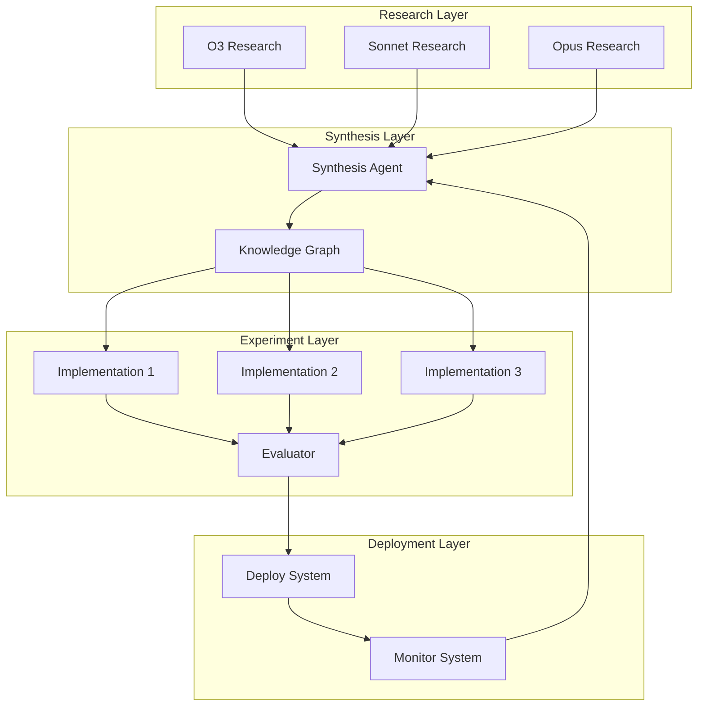

# ADR-0001: Implement Self-Perpetuating Research Loop

**Status**: Accepted  
**Date**: 2025-07-20  
**Deciders**: MCP Architecture Team  
**Categories**: Architecture, Automation, CI/CD  

## Context and Problem Statement

We need a system that can automatically transform AI research insights into production-ready implementations without constant human intervention. The traditional software development lifecycle requires significant manual effort at each stage, creating bottlenecks and inconsistencies.

How can we create a fully automated pipeline that continuously improves itself based on multi-model AI research?

## Decision Drivers

- **Automation**: Minimize human intervention in the development process
- **Quality**: Maintain high standards for code, testing, and documentation
- **Scalability**: Handle multiple research topics and implementations in parallel
- **Adaptability**: Incorporate new AI models and technologies as they emerge
- **Observability**: Track performance and make data-driven improvements

## Considered Options

### Option 1: Traditional CI/CD Pipeline
- **Pros**: Well-understood, mature tooling, predictable
- **Cons**: Requires manual intervention, no self-improvement

### Option 2: Semi-Automated Research Integration
- **Pros**: Some automation benefits, human oversight
- **Cons**: Still has bottlenecks, inconsistent quality

### Option 3: Fully Automated Research → Deploy Loop (Chosen)
- **Pros**: Fully autonomous, self-improving, consistent quality
- **Cons**: Complex initial setup, requires robust error handling

## Decision Outcome

Chosen **Option 3: Fully Automated Research → Deploy Loop**

### Positive Consequences

- **Continuous Improvement**: Each iteration learns from previous ones
- **Parallel Processing**: Multiple experiments run simultaneously
- **Consistent Quality**: Automated quality gates ensure standards
- **Rapid Innovation**: New ideas move from research to production quickly
- **Knowledge Synthesis**: Combines insights from multiple AI models

### Negative Consequences

- **Complexity**: Requires sophisticated orchestration
- **Initial Investment**: Significant setup effort required
- **Error Propagation**: Automated errors could compound
- **Resource Usage**: Parallel experiments consume significant compute

## Implementation Details

### Architecture Components

### Quality Gates

Each phase enforces strict quality criteria:

1. **Research Phase**
   - Valid YAML front-matter
   - Complete 5-file structure
   - Proper citations and references

2. **Synthesis Phase**
   - Minimum convergence threshold
   - Comprehensive prompt generation
   - Knowledge graph validation

3. **Experiment Phase**
   - Code coverage ≥ 90%
   - Lighthouse scores ≥ 90/90/90/100
   - Zero HIGH security findings
   - All tests passing

4. **Deploy Phase**
   - Health checks passing
   - Performance benchmarks met
   - Documentation complete

### Technology Stack

- **Orchestration**: GitHub Actions with matrix builds
- **Backend**: FastAPI with async support
- **Frontend**: Next.js 13+ with App Router
- **Testing**: pytest, Playwright, Lighthouse CI
- **Security**: Semgrep, Bandit, OWASP compliance
- **Documentation**: MkDocs Material
- **Infrastructure**: Docker, Kubernetes, Traefik

## Related Decisions

- ADR-0002: Use GitHub Actions for CI/CD
- ADR-0003: Adopt Next.js 13+ for Frontend
- ADR-0004: Implement WebSocket Communication

## References

- [Continuous Deployment at GitHub](https://github.blog/2021-03-23-continuous-deployment-at-github/)
- [The Phoenix Project](https://itrevolution.com/the-phoenix-project/)
- [Site Reliability Engineering](https://sre.google/books/)
- [MADR Template](https://github.com/adr/madr)

## Notes

This decision represents a significant shift in how we approach software development. By automating the entire pipeline from research to deployment, we create a system that:

1. **Learns**: Each iteration improves based on metrics
2. **Scales**: Handles multiple topics in parallel
3. **Evolves**: Incorporates new technologies automatically
4. **Documents**: Maintains comprehensive documentation

The success of this approach depends on:
- Robust error handling and recovery
- Comprehensive monitoring and alerting
- Clear quality gates at each phase
- Regular review of the automation itself

Future enhancements may include:
- Multi-cloud deployment strategies
- A/B testing frameworks
- Cost optimization algorithms
- Advanced ML-based quality prediction 