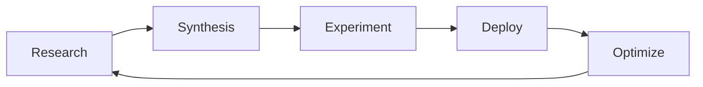

# The Σ-Builder Loop: A Self-Perpetuating AI Development Pipeline

## Overview

The Σ-Builder Loop is a fully automated, self-perpetuating development pipeline that transforms research insights into production-ready code through a continuous cycle of:



## The Five Phases

### 1. Research Phase 📚

**Purpose**: Gather and structure knowledge from multiple AI models about specific topics.

**Process**:
- Research is organized in `research/<topic>/<model>/` directories
- Each model (O3, Claude-4-Sonnet, Claude-4-Opus) provides perspectives on the same topic
- Research documents follow a standardized 5-file structure:
  - `01_overview.md` - High-level introduction
  - `02_architecture.md` - Technical architecture details
  - `03_prompt_design.md` - Prompt engineering strategies
  - `04_codebase_setup.md` - Implementation guidelines
  - `05_enhancements.md` - Future improvements and optimizations

**Outputs**:
- Structured markdown files with YAML front-matter
- Cross-model insights and perspectives
- Enhancement opportunities

### 2. Synthesis Phase 🔀

**Purpose**: Merge insights from multiple models into unified implementation strategies.

**Process**:
- Automated synthesis agents read all research files
- Extract convergent patterns (where models agree)
- Identify divergent approaches (where models differ)
- Generate unified implementation prompts

**Key Components**:
```python
class SynthesisAgent:
    def process_research(self) -> KnowledgeGraph:
        # Extract insights from each model
        # Identify consensus and divergences
        # Build unified knowledge representation
```

**Outputs**:
- `synthesize-research-prompts/<model>/AGENT_IMPLEMENTATION_PROMPT.md`
- Synthesis reports documenting consensus and divergences
- Updated Σ-Builder prompt for future iterations

### 3. Experiment Phase 🧪

**Purpose**: Generate and test multiple implementations based on synthesized research.

**Process**:
1. **Matrix Testing**: Run implementations across different model/prompt combinations
2. **Performance Evaluation**: Measure speed, accuracy, resource usage
3. **Quality Assessment**: Check code quality, test coverage, security
4. **UI/UX Validation**: Lighthouse scores, accessibility tests

**Automated Triggers**:
```bash
# Triggered automatically when research files change
python scripts/trigger_experiment.py
```

**Outputs**:
- Multiple implementation variants in `experiments/<date>/`
- Performance comparison reports
- Winner selection based on objective metrics

### 4. Deploy Phase 🚀

**Purpose**: Deploy the winning implementation to production.

**Infrastructure**:
```yaml
# docker-compose.prod.yml
services:
  traefik: # Reverse proxy with SSL
  web:     # FastAPI backend
  ui:      # Next.js frontend
  redis:   # Caching layer
  postgres: # Database
```

**Features**:
- Zero-downtime deployments
- Automatic SSL certificates
- Security headers and rate limiting
- Real-time monitoring

**Outputs**:
- Production deployment at configured domain
- Performance metrics and logs
- Documentation site via MkDocs

### 5. Optimize Phase ⚡

**Purpose**: Learn from production usage to improve future iterations.

**Process**:
1. **Metrics Collection**: Gather performance, error, and usage data
2. **Pattern Analysis**: Identify bottlenecks and improvement opportunities
3. **Research Generation**: Create new research topics based on findings
4. **Loop Restart**: Trigger new research phase with optimization focus

**Feedback Mechanisms**:
- User feedback integration
- Automated performance analysis
- Error pattern detection
- Resource optimization suggestions

## Implementation Details

### Workflow Automation

The entire loop is orchestrated through GitHub Actions:

```yaml
# .github/workflows/multi-agent-experiment.yml
on:
  push:
    paths:
      - 'research/**'
  workflow_dispatch:
    inputs:
      research_topics:
        description: 'Topics to process'
```

### Quality Gates

Each phase has strict acceptance criteria:

- **Research**: YAML front-matter validation
- **Synthesis**: Convergence threshold met
- **Experiment**: 
  - pytest ≥ 90% coverage
  - Lighthouse ≥ 90/90/90/100
  - Zero HIGH security findings
- **Deploy**: All health checks pass
- **Optimize**: Metrics improvement validated

### UI-First Development

Every component includes:
- Next.js 13+ App Router implementation
- Storybook documentation
- Playwright E2E tests
- Accessibility compliance

## Bootstrap Process

To start a new loop iteration:

1. **Create Research Topic**:
   ```bash
   mkdir -p research/new-topic/{o3,claude-4-sonnet,claude-4-opus}
   ```

2. **Add Research Files**:
   - Follow the 01-05 structure
   - Include YAML front-matter

3. **Commit and Push**:
   ```bash
   git add research/new-topic
   git commit -m "Research: Add new-topic investigation"
   git push
   ```

4. **Automatic Trigger**:
   - CI detects research changes
   - Synthesis begins automatically
   - Experiments run in parallel
   - Best implementation deploys

## Monitoring and Observability

### Dashboards
- Real-time workflow status
- Agent performance metrics
- Resource utilization graphs

### Tracking
- GitHub Issues for each experiment
- Detailed logs for each phase
- Performance trend analysis

## Security Considerations

- All code scanned with Semgrep and Bandit
- OWASP Top 10 compliance enforced
- Automated security updates
- Sandboxed execution environments

## Future Enhancements

The loop is designed to evolve:

1. **Multi-Language Support**: Extend beyond Python/TypeScript
2. **Distributed Experiments**: Run on multiple cloud providers
3. **AI Model Integration**: Add new AI models as they emerge
4. **Performance Optimization**: Continuous improvement based on metrics

## Conclusion

The Σ-Builder Loop represents a paradigm shift in software development:
- **Autonomous**: Runs without human intervention
- **Self-Improving**: Learns from each iteration
- **Quality-First**: Enforces best practices automatically
- **Scalable**: Handles multiple topics in parallel

By combining the strengths of multiple AI models with rigorous engineering practices, the loop creates a sustainable, ever-improving development ecosystem. 