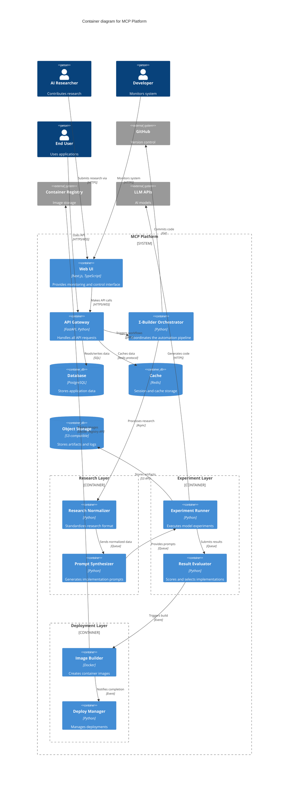

# C4 Model - Container Diagram

## Container View of MCP Platform

This diagram shows the high-level containers (applications, databases, file systems) that make up the MCP Platform.

## Container Descriptions

### Frontend Layer

#### Web UI
- **Technology**: Next.js 13+ with TypeScript
- **Purpose**: Monitoring dashboard and control interface
- **Features**:
  - Real-time pipeline status
  - Research submission interface
  - Deployment management
  - Performance metrics visualization

### API Layer

#### API Gateway
- **Technology**: FastAPI with async Python
- **Purpose**: Central API endpoint for all services
- **Features**:
  - RESTful endpoints
  - WebSocket support for real-time updates
  - Authentication and authorization
  - Rate limiting and caching

### Orchestration Layer

#### Σ-Builder Orchestrator
- **Technology**: Python with Celery
- **Purpose**: Coordinates the entire automation pipeline
- **Responsibilities**:
  - Workflow management
  - Task scheduling
  - State management
  - Error handling and retries

### Research Processing

#### Research Normalizer
- **Technology**: Python
- **Purpose**: Standardizes research input format
- **Functions**:
  - File validation
  - Front-matter parsing
  - Content extraction
  - Structure normalization

#### Prompt Synthesizer
- **Technology**: Python with Jinja2
- **Purpose**: Generates model-specific implementation prompts
- **Features**:
  - Multi-model synthesis
  - Enhancement extraction
  - Requirement compilation
  - Prompt optimization

### Experiment Execution

#### Experiment Runner
- **Technology**: Python with asyncio
- **Purpose**: Executes experiments on different models
- **Capabilities**:
  - Parallel execution
  - Resource management
  - Progress tracking
  - Error recovery

#### Result Evaluator
- **Technology**: Python with NumPy/Pandas
- **Purpose**: Analyzes and scores experiment results
- **Metrics**:
  - Code quality scores
  - Test coverage
  - Performance benchmarks
  - Security scan results

### Deployment Management

#### Image Builder
- **Technology**: Docker Buildx
- **Purpose**: Creates multi-architecture container images
- **Features**:
  - Multi-stage builds
  - Layer caching
  - Security scanning
  - Size optimization

#### Deploy Manager
- **Technology**: Python with Kubernetes client
- **Purpose**: Manages production deployments
- **Functions**:
  - Blue-green deployments
  - Health monitoring
  - Rollback management
  - Traffic shifting

### Data Storage

#### PostgreSQL Database
- **Purpose**: Primary data storage
- **Stores**:
  - User data
  - Experiment results
  - Deployment history
  - System configuration

#### Redis Cache
- **Purpose**: High-speed caching and queuing
- **Uses**:
  - Session storage
  - API response caching
  - Task queue backend
  - Real-time data

#### Object Storage
- **Purpose**: Large file and artifact storage
- **Stores**:
  - Generated code
  - Docker images
  - Logs and metrics
  - Research documents

## Communication Patterns

### Synchronous
- HTTP/HTTPS for API calls
- WebSocket for real-time updates
- gRPC for service-to-service

### Asynchronous
- Message queues for task distribution
- Event bus for system notifications
- Webhooks for external integrations

---

## Next: [Component Diagram](./c4-component.md) 