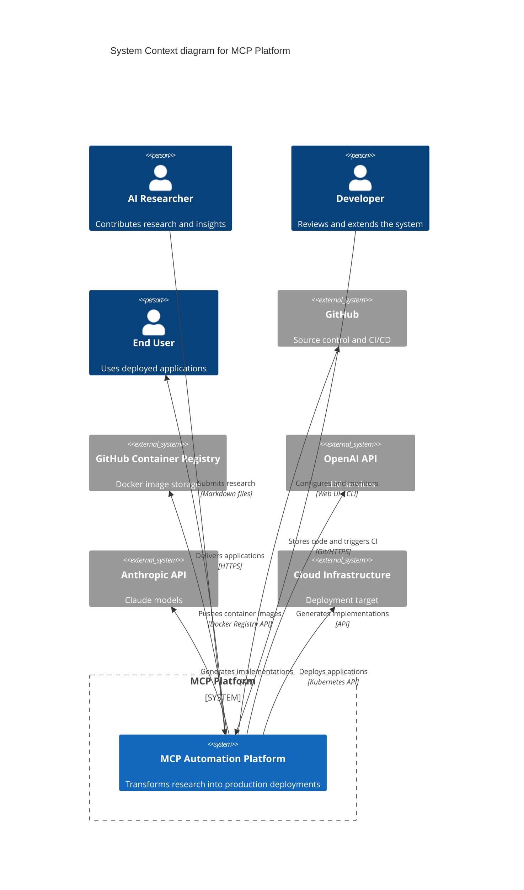

# C4 Model - Context Diagram

## System Context for MCP Platform

The MCP (Multi-Agent Collaborative Platform) operates as an autonomous research-to-production pipeline that transforms AI model insights into deployable software without human intervention.

## Key Actors

### Researchers
- Submit research findings in structured markdown format
- Define enhancements and future directions
- Contribute multi-model perspectives

### Developers
- Monitor system performance
- Review generated implementations
- Extend platform capabilities

### End Users
- Access deployed applications
- Benefit from continuous improvements
- Provide indirect feedback through usage metrics

## External Systems

### GitHub
- Hosts source code repository
- Runs GitHub Actions workflows
- Manages pull requests and issues

### Container Registries
- Stores multi-architecture Docker images
- Enables versioned deployments
- Supports rollback capabilities

### LLM Providers
- Generate code implementations
- Process synthesis prompts
- Provide model-specific insights

### Cloud Infrastructure
- Hosts production deployments
- Provides compute resources
- Enables global distribution

## Data Flows

1. **Research Input**: Markdown files → Git repository
2. **Synthesis**: Research files → Implementation prompts
3. **Generation**: Prompts → Code implementations
4. **Evaluation**: Implementations → Performance metrics
5. **Deployment**: Docker images → Production environment

---

## Next: [Container Diagram](./c4-container.md) 