# MCP - Multi-Agent Codebase Platform

<div align="center">
  
[](https://github.com/mcp/mcp/actions)
[](https://codecov.io/gh/mcp/mcp)
[](https://github.com/mcp/mcp/security)
[](https://mcp-docs.example.com)
[](LICENSE)

</div>

## 🚀 Welcome to MCP

MCP is a revolutionary self-perpetuating development platform that transforms AI research insights into production-ready code through an automated **Research → Synthesis → Experiment → Deploy → Optimize** pipeline.

!!! success "Key Features"
    - 🤖 **Multi-Model AI Integration**: Harnesses O3, Claude-4-Sonnet, and Claude-4-Opus
    - 🔄 **Fully Automated Pipeline**: From research to production without human intervention
    - 📊 **Data-Driven Optimization**: Continuous improvement based on metrics
    - 🛡️ **Security-First**: OWASP compliant with automated security scanning
    - 🎨 **Modern UI/UX**: Next.js 13+ with real-time updates

## 🎯 Quick Start

Get up and running with MCP in minutes:

```bash
# Clone the repository
git clone https://github.com/mcp/mcp.git
cd mcp

# Install dependencies
make install

# Run locally
docker-compose up -d

# Access the platform
open http://localhost:3000
```

## 📚 Documentation Structure

<div class="grid cards" markdown>

-   :material-book-open-variant:{ .lg .middle } **Getting Started**

    ---

    Learn the basics and get your first experiment running

    [:octicons-arrow-right-24: Installation](getting-started/installation.md)

-   :material-microscope:{ .lg .middle } **Research System**

    ---

    Understand how multi-model research drives the platform

    [:octicons-arrow-right-24: Research Overview](research/index.md)

-   :material-architecture:{ .lg .middle } **Architecture**

    ---

    Explore the system design and technical decisions

    [:octicons-arrow-right-24: C4 Diagrams](architecture/c4-context.md)

-   :material-api:{ .lg .middle } **API Reference**

    ---

    Complete API documentation with examples

    [:octicons-arrow-right-24: API Docs](api/index.md)

</div>

## 🔄 The Σ-Builder Loop

The heart of MCP is the self-perpetuating development loop:

```mermaid
graph LR
    A[📚 Research] --> B[🔀 Synthesis]
    B --> C[🧪 Experiment]
    C --> D[🚀 Deploy]
    D --> E[⚡ Optimize]
    E --> A
    
    style A fill:#e1f5fe
    style B fill:#f3e5f5
    style C fill:#fff3e0
    style D fill:#e8f5e9
    style E fill:#fce4ec
```



Each phase is fully automated with strict quality gates:

| Phase | Quality Requirements | Outputs |
|-------|---------------------|---------|
| **Research** | Valid YAML front-matter | Structured insights |
| **Synthesis** | Convergence threshold met | Implementation prompts |
| **Experiment** | 90%+ coverage, Lighthouse 90+ | Tested implementations |
| **Deploy** | All health checks pass | Production system |
| **Optimize** | Metrics improvement | New research topics |

## 🏗️ Architecture Overview

MCP uses a microservices architecture with these key components:

=== "Backend Stack"

    - **FastAPI**: High-performance async API
    - **PostgreSQL**: Primary data store
    - **Redis**: Caching and pub/sub
    - **WebSockets**: Real-time updates

=== "Frontend Stack"

    - **Next.js 13+**: App Router for modern React
    - **Tailwind CSS**: Utility-first styling
    - **Radix UI**: Accessible components
    - **Socket.io**: Real-time communication

=== "Infrastructure"

    - **Docker**: Container platform
    - **Traefik**: Reverse proxy with SSL
    - **GitHub Actions**: CI/CD pipeline
    - **MkDocs**: Documentation site

## 📊 Performance Metrics

Our automated quality gates ensure exceptional performance:

<div class="grid cards" markdown>

-   **Code Coverage**
    
    ```
    ████████████████████ 95%
    ```
    
    All code must maintain ≥90% test coverage

-   **Lighthouse Score**
    
    ```
    Performance: 94
    Accessibility: 96
    Best Practices: 92
    SEO: 100
    ```

-   **Security Scan**
    
    ```
    ✅ 0 HIGH vulnerabilities
    ✅ 0 CRITICAL issues
    ✅ OWASP Top 10 compliant
    ```

-   **API Performance**
    
    ```
    p50: 45ms
    p95: 120ms
    p99: 198ms
    ```

</div>

## 🛠️ Development Workflow

### Adding New Research

1. Create research files following the standard structure:
   ```
   research/your-topic/
   ├── o3/
   ├── claude-4-sonnet/
   └── claude-4-opus/
       ├── 01_overview.md
       ├── 02_architecture.md
       ├── 03_prompt_design.md
       ├── 04_codebase_setup.md
       └── 05_enhancements.md
   ```

2. Commit and push - the pipeline triggers automatically!

### Monitoring Experiments

Track your experiments in real-time:

- 📊 **Dashboard**: Live status at `/dashboard`
- 📝 **Logs**: Detailed logs for each phase
- 📈 **Metrics**: Performance comparisons
- 🎯 **Results**: Winner selection rationale

## 🤝 Contributing

We welcome contributions! Please see our [Contributing Guide](contributing.md) for details.

### Development Setup

```bash
# Install development dependencies
make dev-setup

# Run tests
make test

# Run linters
make lint

# Build documentation
make docs
```

## 📖 Learn More

!!! tip "Recommended Reading"
    - [The Σ-Builder Loop Explained](LOOP.md)
    - [Architecture Decision Records](ADR/0001-research-loop.md)
    - [API Integration Guide](api/index.md)
    - [Deployment Best Practices](deployment/production.md)

## 🌟 Showcase

Projects built with MCP:

- **AI Code Generator**: Generates production-ready code from requirements
- **Documentation Bot**: Automatically maintains up-to-date documentation
- **Security Scanner**: Continuous security assessment and remediation
- **Performance Optimizer**: ML-driven performance improvements

## 📝 License

MCP is open source software licensed under the [MIT License](https://github.com/mcp/mcp/blob/main/LICENSE).

---

<div align="center">
  <p>Built with ❤️ by the MCP Team</p>
  <p>
    <a href="https://github.com/mcp/mcp">GitHub</a> •
    <a href="https://mcp-docs.example.com">Documentation</a> •
    <a href="https://mcp-community.slack.com">Community</a>
  </p>
</div> 